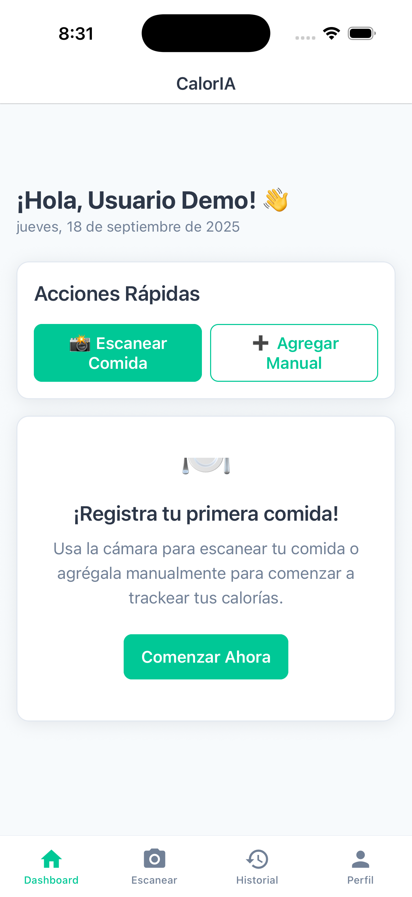

# 🥗 CalorIA Demo - Smart Calorie Tracker

> **Demo Version** - Interactive demo with UI showcase

## ✨ Live Demo Features

- 📱 **Complete UI/UX** - Full interface design and navigation
- 🎨 **Design System** - Custom components and theme
- 📊 **Mock Data** - Sample nutrition tracking and progress
- 🔐 **Demo Authentication** - Simulated user login flow
- 📸 **UI Mockups** - Camera and food recognition interfaces

## 🚀 Try the Demo

```bash
npm install
npm run demo
```

## 📱 Screenshots



## 🛠️ Technologies

- **React Native** + TypeScript
- **Expo** development platform
- **React Navigation** (Stack + Tabs)
- **Zustand** state management
- **Custom Design System**
- **Responsive UI Components**

## 🔗 Links

- **Contact**: [estefreric@gmail.com](mailto:estefreric@gmail.com)
- **Portfolio**: [https://alfargenis.github.io/](https://alfargenis.github.io/)
- **LinkedIn**: [https://www.linkedin.com/in/alfargenis/](https://www.linkedin.com/in/alfargenis/)

---

*This is a demo version of the app. The premium version includes all complete functionalities with AI, real-time data, and advanced features.*
